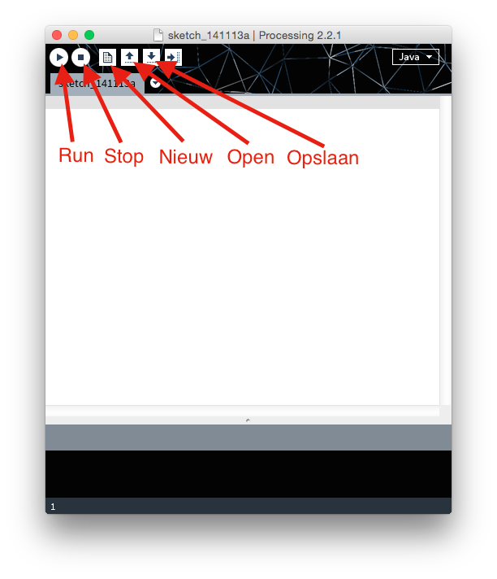

Werken met Processing
=====================

Java is één van de populairste programmeertalen.  Processing is feitelijk Java.
Er is alleen een aantal functies bijgeschreven (in Java) waarmee je eenvoudig
op het scherm kunt tekenen.  Ook wordt Processing geleverd met een
editor waarin je je programma kunt schrijven, en makkelijk kunt draaien.

In deze eerste les maak je kennis met de editor, en zet je de eerste stappen
in programmeren met Processing.

De editor
---------

Hieronder zie je het standaard venster van Processing. Met de knoppen *Run* en *Stop*
kun je straks je programma testen. Met *Nieuw*, *Open* en *Bewaar* kun je een nieuw
programma starten, een programma openen of je programma bewaren op schijf.

In het grote lege venster kun je je eigen programma in gaan typen.  Processing
kent twee soorten programma's: *statisch* en *dynamisch*.

Een statisch programma
----------------------

Een *statisch* programma is een programma dat niets méér doet dan één keer
iets op het scherm tekenen.  Er beweegt dus verder niets.  Zo'n soort
programma heeft geen structuur.  Je kunt meteen beginnen met programmeren.
Als je bijvoorbeeld een ellips wilt tekenen is het volgende programma
voldoende::

    ellipse(50, 50, 30, 30);

Dit programma tekent een ellips op positie (50, 50) en straal 30.

Een dynamisch programma
-----------------------

Een *dynamisch* programma is een programma waar dingen veranderen. Er
kunnen bijvoorbeeld dingen bewegen (een stuiterend balletje) of het
programma kan reageren op de gebruiker (de muis volgen, reageren op het
toesenbord).  Vrijwel alle programma's zullen dynamisch zijn.  Zo'n
programma heeft twee verplichte onderdelen: een ``setup()`` en een
``draw()`` functie.  In de ``setup()`` plaats je opdrachten die alléén aan
het begin van het programma hoeven worden uitgevoerd.  Deze worden ook
maar één keer aangeroepen.  Binnen ``draw()`` plaats je opdrachten die
steeds opnieuw herhaald moeten worden.  De opdracht om een venster van 600
bij 400 pixels te openen gaat in ``setup()``, maar de opdrachten om het
scherm leeg te maken en een cirkel te tekenen gaan in ``draw()``.  Een
functie heeft een beetje merkwaardige notatie, waar je vast aan moet
wennen.  Bijvoorbeeld::

    void setup() {
        size(600, 400);
        // andere opdrachten die maar *een* keer worden uitgevoerd.
    }

    void draw() {
        background(0);
        ellipse(50, 50, 30, 30);
        // andere oprachten die moeten worden herhaald.
    }
